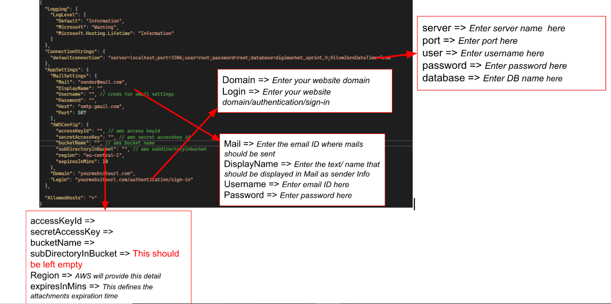
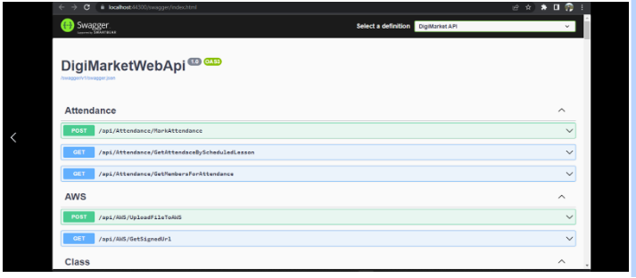

# DigiMarket_BackendDotNetCore Repository
Requirements:  
   `.Net core 3.1`  
    `Visual studio 2019 or 2022`  
    `My Sql Server and WorkBench`  

   * To run the api locally you have to Modify configuration strings in the appsettings.json file.
   * The location of appsettings.json file is: ** DigiMarket\DigiMarketWebApi\appsettings.json **  

  

   * This is how you can get S3 configuration keys from AWS   
   [https://docs.aws.amazon.com/powershell/latest/userguide/pstools-appendix-sign-up.html](https://docs.aws.amazon.com/powershell/latest/userguide/pstools-appendix-sign-up.html) 
   *  Restore the backup schema of the database provided with a repository in the Db folder. Use MySql workbench to restore the db and update your connection string in the appsettings file.  
   *  After completing the configuration you have to start the app by running visual studio in debug mode. You can publish in release mode if you like.  
   This is how it will run with swagger documentation  

  

   ## Video Guide Below  
   [https://www.awesomescreenshot.com/video/17734978?key=9352ff78199f88c562c86991ebb3b251](https://www.awesomescreenshot.com/video/17734978?key=9352ff78199f88c562c86991ebb3b251)

